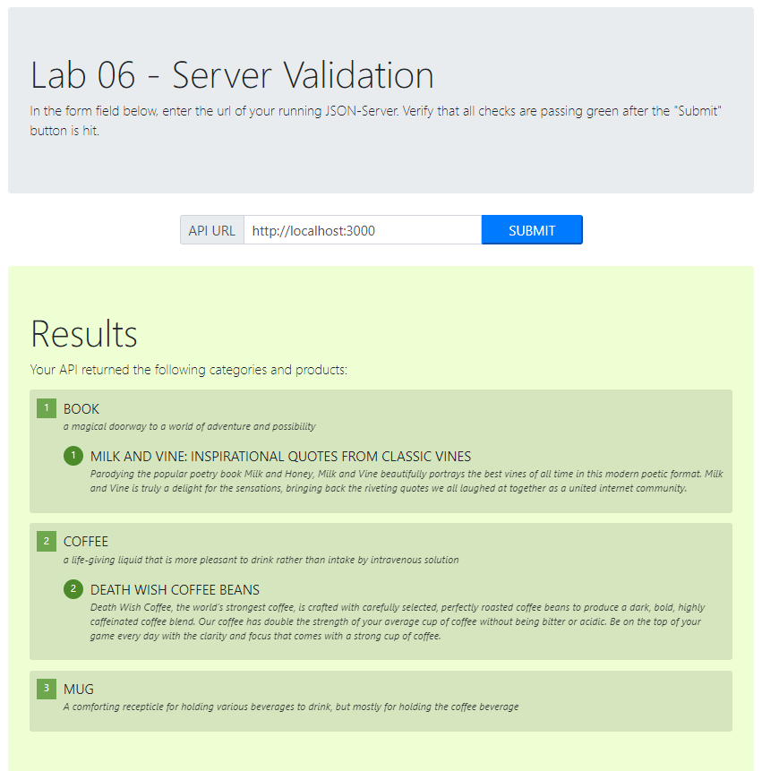

# LAB - Code 401n16

## HTTP && REST
js-401n16 lab-06:  working with a very simple server’s API, documenting it and testing it.

### Author: Madison Stehle

### Links and Resources

- [submission PR](https://github.com/madisonstehle/http-and-rest/pull/2)

### Documentation

- [swagger url](https://app.swaggerhub.com/apis/madisonstehle/lab06-categories_and_products/0.1#/)
- [swagger.json](./docs/swagger.json)

### Setup
<!-- How to initialize/run your application (where applicable) -->
- Run Server: `json-server --watch ./data/db.json`

#### Tests

- Unit Test: `npm test`
- Lint Test: `npm run lint`

#### Validation

## Credits
- [Milk and Vine](https://www.amazon.com/Milk-Vine-Inspirational-Quotes-Classic-ebook/dp/B076NWPQYZ)
- [Death Wish Coffee](https://www.deathwishcoffee.com/products/death-wish-coffee)